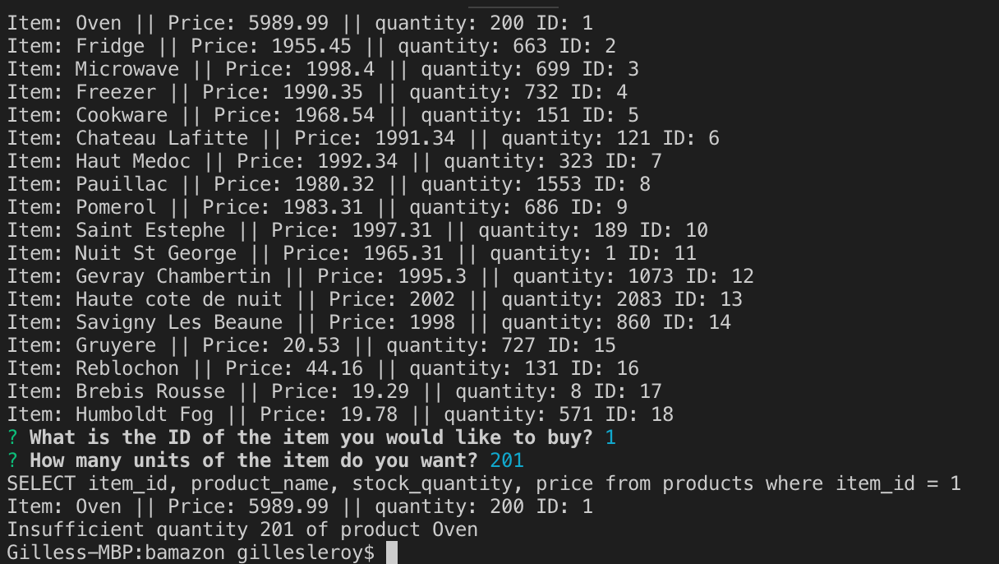

# bamazon App
## UCB Extension Homework to demonstrate skills with mysql and inquirer
### This will allow a user to place an order from a list of products:
### The user will be prompted for a product Id and a quantity
### If the quantity exists in stock the product quantity will be reduced by the quantity ordered and
### a total cost will be calculated and displayed
### See below screenshots of the action:

